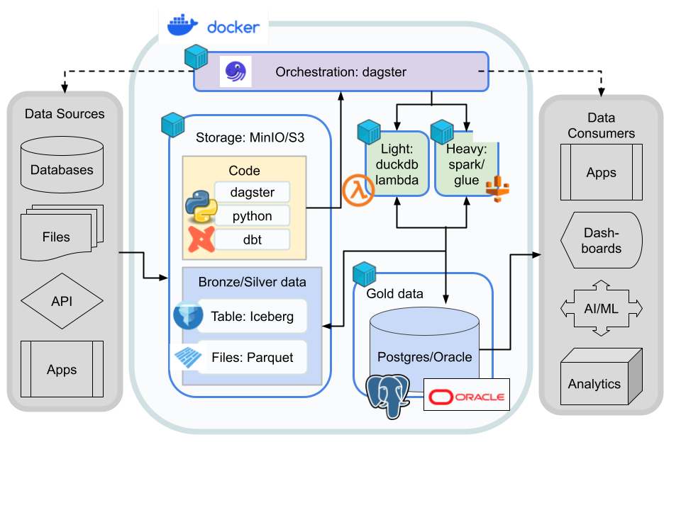

# ⛵ sloop

**A local-first reference architecture for an open data lakehouse.**

sloop is a documented, deployable architecture for data engineering built entirely from
open-source components. It exists to answer a specific question: what does a complete analytical
data platform look like when you refuse proprietary warehouse lock-in, and when it has to run on a
laptop or inside a disconnected environment as readily as in the cloud?

The result is a stack that a data scientist or engineer can stand up with Docker Compose, develop
against locally, and move to cloud infrastructure without rewriting pipelines — because every
component has either an identical cloud counterpart or no cloud dependency at all.

> **Attribution.** The `dagster/` directory vendors Dagster's own
> [`project_fully_featured`](https://github.com/dagster-io/dagster/tree/master/examples/project_fully_featured)
> example, included unmodified as the working reference implementation for this architecture. That
> code is Dagster's, under its original license. The architecture selection and rationale, the
> documentation, the MinIO object-storage layer, and the Docker Compose deployment are mine.



## Design goals

1. **No vendor lock-in.** Every component is open-source and independently replaceable. Nothing in
   the stack requires a paid platform to run or to keep your data readable.
2. **Local development parity.** The same commands and skills work locally and in the cloud, so
   pipelines are developed and tested where iteration is fast.
3. **Disconnected capable.** The full stack runs with no internet access, which matters for
   regulated, air-gapped, and field environments.
4. **Files stay readable.** Data is Parquet on object storage. Any tool that reads Parquet can read
   it, with or without this platform.
5. **Low maintenance surface.** Simplifies data engineering without extensive time spent
   maintaining microservice infrastructure.

## Components and why each one

### Orchestration: Dagster
Dagster takes a data-centric approach to task orchestration. Built in Python and designed to treat
data as assets rather than tasks, it makes it easy to track data dependencies and lineage. It was
developed specifically to enable local development of data pipelines, unit testing, CI, code
review, staging environments, and debugging, with an elegant syntax. It bundles a UI for
visualizing pipelines and monitoring data assets and execution.

### Storage: MinIO
MinIO is an object storage service that is API-compatible with Amazon S3. It provides a storage
container for testing data workflows locally using the identical commands and skills needed to
handle data on S3 — which is what makes local-to-cloud parity real rather than aspirational. In a
disconnected environment it extends into a multi-node instance for stable offline storage.

### File format: Apache Parquet
A column-oriented data file format designed for efficient storage and retrieval. Small and highly
compressible, Parquet allows fast read and write times and supports nested and evolving data
structures, making it suitable for complex data. The columnar layout lets queries fetch specific
values without scanning whole rows.

### Table format: Apache Iceberg
Iceberg uses metadata to impose a table structure on top of Parquet files, allowing millions of
files to be modified and queried as if they were a relational database. Iceberg metadata describes
a distributed table structure with snapshots, supporting partitioning and time travel for
structured, scalable table management within the lakehouse.

### Query engine: Apache Spark
Spark provides the distributed compute layer for work that exceeds a single process: large joins,
full-table rewrites, and Iceberg maintenance operations such as compaction and snapshot expiry. It
reads and writes Parquet and Iceberg natively, so it operates on the same files as everything else
in the stack rather than requiring a separate copy of the data. The reference implementation in
`dagster/` uses Dagster's PySpark integration, so Spark work is expressed as ordinary assets with
the same lineage and testing story as the rest of the graph. For smaller analytical workloads Spark
can be omitted entirely — DuckDB against the same Parquet files is often the better tool, and
nothing else in the architecture changes.

### SQL templating and lineage: dbt
dbt is a templating workflow that places guardrails around data, enabling analysts to collaborate
on data models, version them, and test and document queries before safely deploying them to
production. Complex queries can be decomposed and recompiled for ease of testing, letting
developers focus on business logic.

## Deployment

```bash
# bring up the platform
docker compose up -d

# object storage only
cd minio && docker compose up -d
```

A devcontainer configuration is included for a consistent development environment.

## Repository layout
docker-compose.yaml # platform stack
minio/ # MinIO object storage stack and configuration
dagster/ # reference implementation (Dagster's project_fully_featured — see Attribution)
Resources/ # architecture diagram and branding
.devcontainer/ # development container definition


## Status

Architecture reference and documentation project. The stack is deployable; the `dagster/` reference
implementation is Dagster's example, retained to demonstrate the orchestration layer in place.

## License

MIT for the architecture, documentation, and deployment configuration in this repository — see
[LICENSE](LICENSE). The vendored `dagster/` example remains under
[Dagster's Apache 2.0 license](https://github.com/dagster-io/dagster/blob/master/LICENSE).
